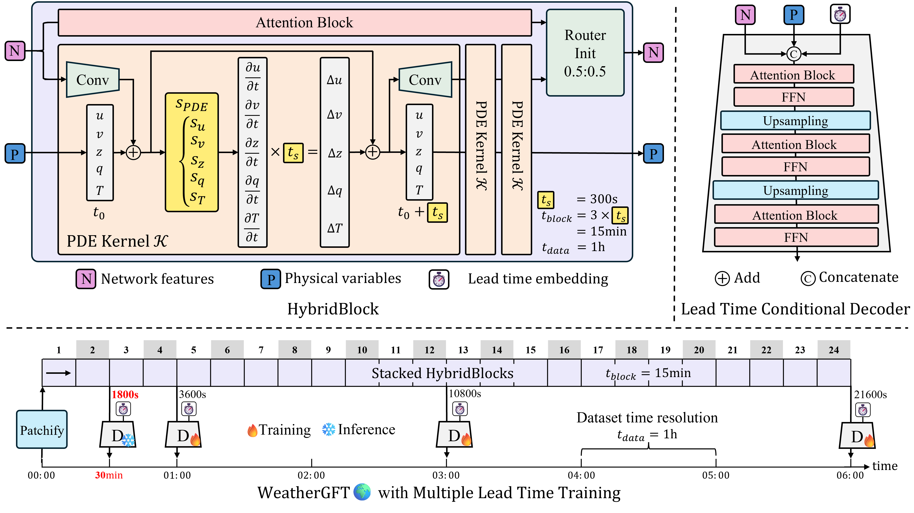
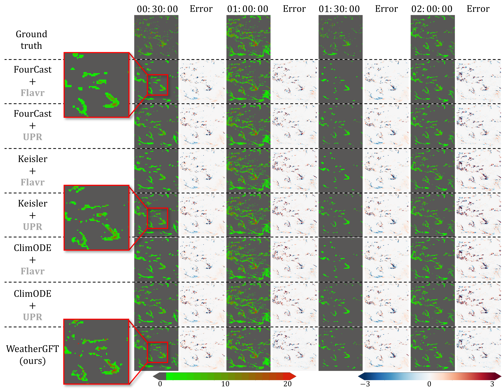

## Physics-AI Hybrid Model 🧭

## Contributions ✅

* We propose a physics-AI hybrid model that incorporates physical PDEs into the networks, enabling the simulation of fine-grained physical evolution through its forward process.
* With the flexible PDE kernel and new lead time-aware training framework, our model performs multiple lead time forecasts, which bridges the nowcast and medium-range forecast.
* For the first time, our model extends the forecasting ability learned from an hourly dataset to make accurate predictions at a finer time scale, i.e., 30 minutes.
* Our model achieves state-of-the-art (SOTA) performance in forecast tasks at different time scales, ranging from nowcast to medium-range forecast.

## Skillful Medium-Range Forecasts 🌤️

From the visualization, our model is more accurate in predicting the subtropical high, as indicated by the highlighted red box. In addition, the prediction error of our model at the lead time of 6-hour is significantly smaller than that of the physical dynamic model ECMWF-IFS. 

## Generalizing to Fine-grained Time Scale for Nowcasting 🌧️

In contrast to conventional black-box AI models used in medium-range weather forecasting, WeatherGFT has the ability to break through the time scale limitations of the dataset, making the generalization to fine-grained temporal scales possible. This capability is facilitated by the dynamic progression of our PDE kernel modeling and multiple lead time training.

To quantify the accuracy of the model's generalized nowcasting, we utilize the satellite precipitation observation dataset from [NASA](https://disc.gsfc.nasa.gov/) as the ground truth, which has a time resolution of 30-minute. We evaluate forecasts at 30, 60, 90, and 120 minutes. It is important to note that data of NASA were not used for training. For other comparison models that cannot directly produce half-hour forecasts, we use the frame interpolation models (i.e., [Flavr](https://github.com/tarun005/FLAVR) and [UPR](https://github.com/srcn-ivl/UPR-Net)) to generate 30-minute predictions.

